# 박진원 👋

사용자에게 보기 좋은 화면과 자연스러운 사용 흐름을 만드는 데 관심이 있습니다.
웹 퍼블리싱 감각을 바탕으로 Java / Spring 기반 웹 개발도 함께 학습하며,
UI와 기능 흐름을 함께 이해하는 웹 개발자로 성장하고 있습니다.

---

## About Me

* 메인 화면, 공통 UI, 레이아웃 구성에 관심이 많습니다.
* JSP/Servlet, Spring MVC 기반 웹 프로젝트를 경험했습니다.
* React와 Spring Boot를 활용한 팀 프로젝트를 진행하고 있습니다.
* 화면 구현뿐 아니라 데이터가 저장되고 처리되는 흐름까지 이해하려고 노력하고 있습니다.
* 팀 프로젝트에서 맡은 역할을 끝까지 구현하고 정리하는 것을 중요하게 생각합니다.

---

## Tech Stack

### Frontend

* HTML5
* CSS3
* JavaScript
* React
* Vite

### Backend

* Java
* JSP / Servlet
* Spring MVC
* Spring Boot
* Spring Data JPA
* REST API

### Database

* PostgreSQL
* MariaDB
* Oracle DB
* SQL

### Tools

* Eclipse
* VS Code
* DBeaver
* Git / GitHub
* Apache Tomcat

---

## Projects

### 1. 모먹지 (Momeogji) — 진행 중

채팅방에서 모임 참여자의 일정, 장소, 인원, 음식 선호를 수집하고,
AI가 실제 음식점 후보를 추천한 뒤 투표와 최종 공지까지 이어주는 **모임 음식점 추천 서비스**입니다.

기존 단체 채팅방에서 따로 진행하던 참여자 확인, 조건 취합, 음식점 검색, 투표, 일정 공지를
채팅방 안의 하나의 사용자 흐름으로 연결하는 것을 목표로 합니다.

#### 담당 역할 — Frontend 및 REST API CRUD

* React 기반 목업 채팅방과 기능 제안 UI 구현
* 날짜, 시간, 장소, 인원, 모임 목적, 음식 선호 설정 화면 구현
* 단계별 입력값과 진행 상태를 관리하는 사용자 흐름 설계
* 카카오맵을 활용한 장소 검색 및 지도 화면 구성
* AI 음식점 추천 결과 카드와 추천 이유 UI 구성
* 후보 음식점 투표 및 재추천 화면 구현
* 최종 약속 정보를 채팅방에 표시하는 공지 카드 구현
* 모임 및 참여자 데이터의 REST API 연동과 CRUD 구현
* WebSocket을 활용한 참여 상태, 투표 결과, 최종 공지의 실시간 화면 반영

#### 주요 화면

| 채팅방 기능 제안 | 날짜 선택 | 시간 선택 |
|---|---|---|
| 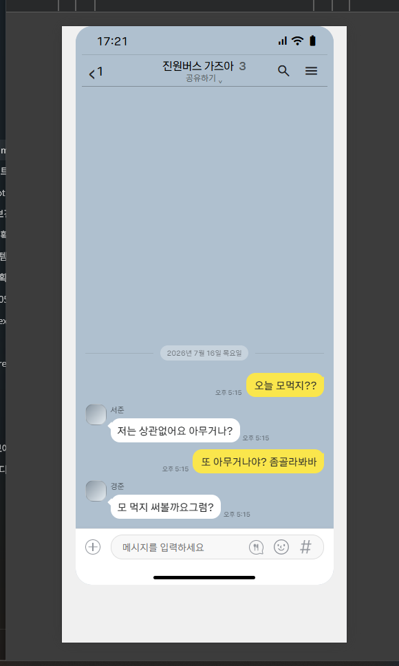 | 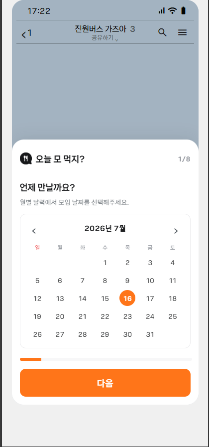 | 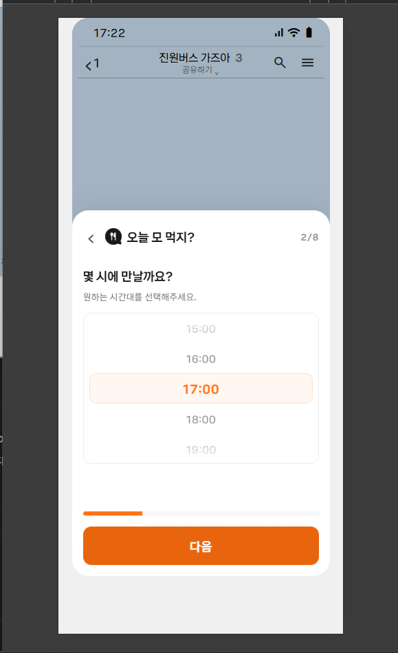 |

| 장소 입력 | 지도 확인 | 참여 인원 |
|---|---|---|
| 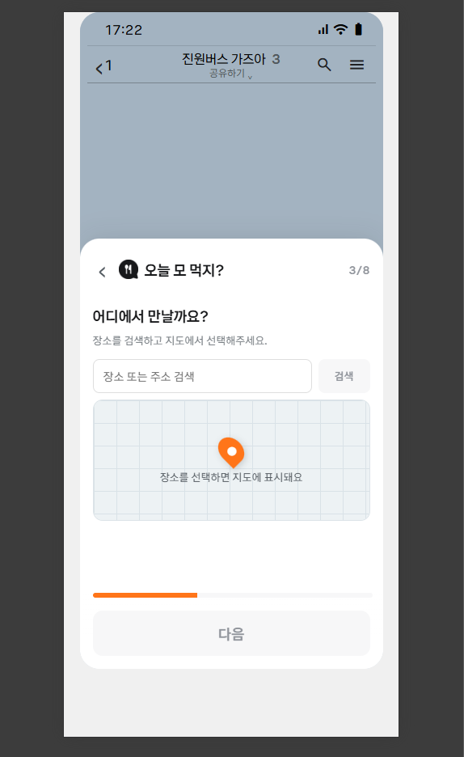 | 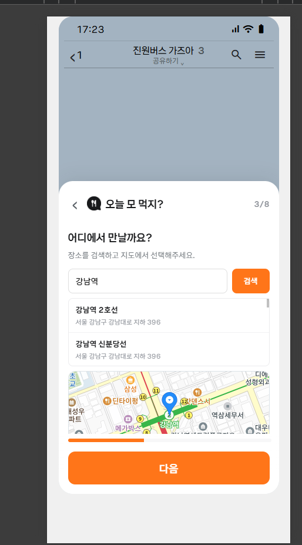 | 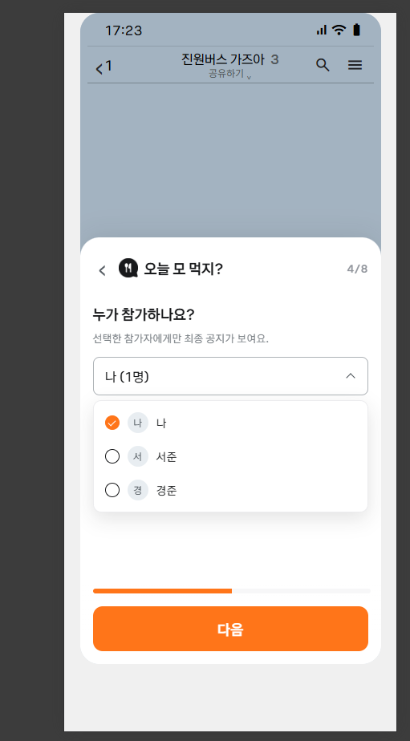 |

| 모임 목적 | 음식 선호 | 채팅방 결과 카드 |
|---|---|---|
| 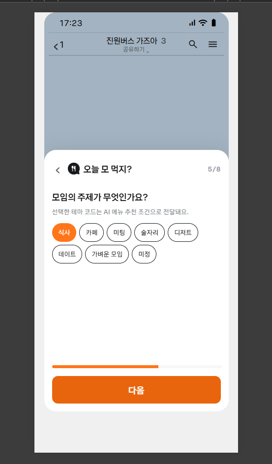 | 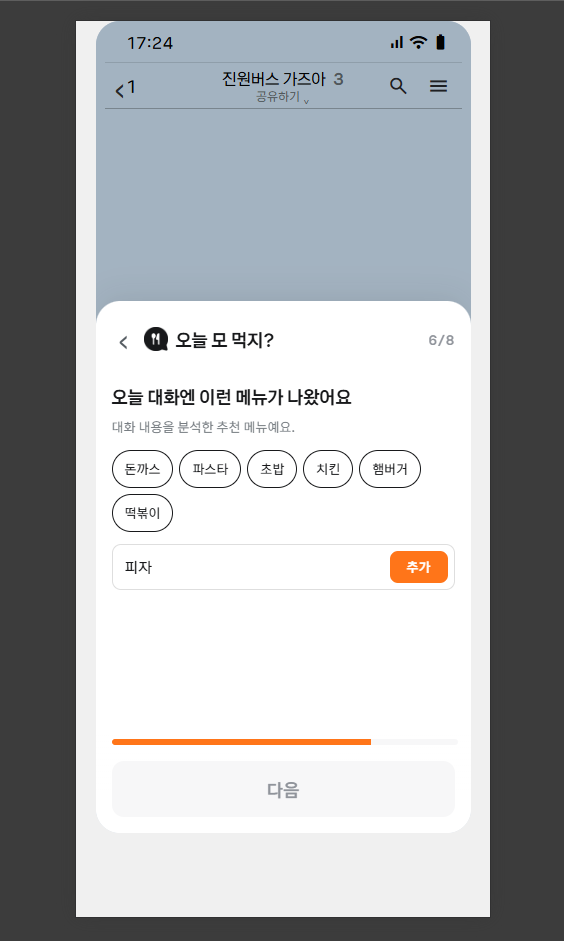 | 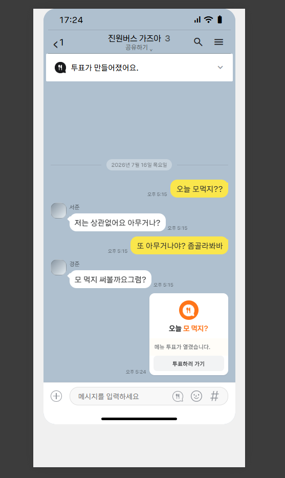 |

| 최종 공지 | 음식점 투표 | 전체 UI 흐름 |
|---|---|---|
| 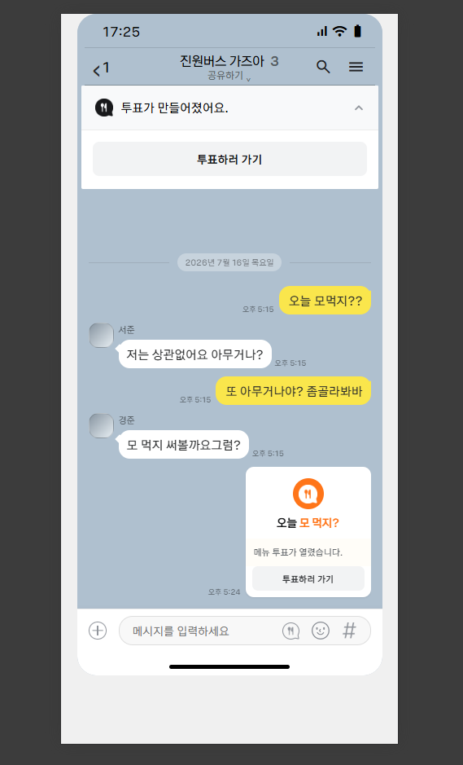 | 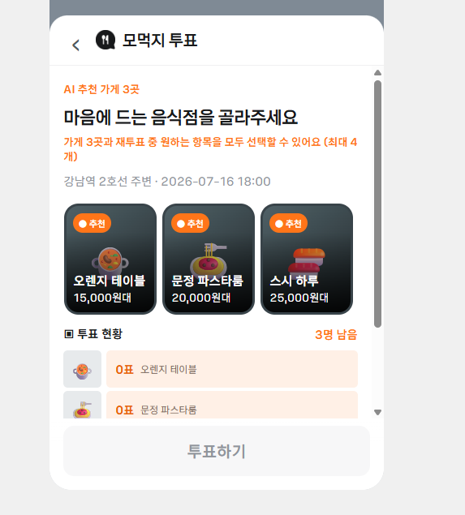 | 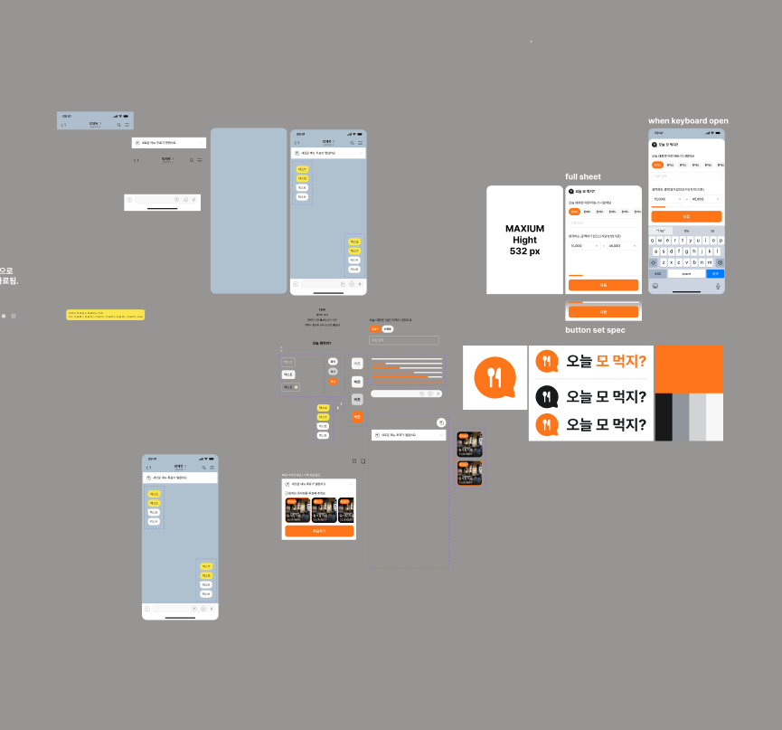 |

#### 사용자 흐름

1. 채팅 내용에서 약속 관련 상황을 감지해 기능 사용을 제안합니다.
2. 사용자가 날짜와 시간을 선택합니다.
3. 기준 장소를 입력하고 지도에서 위치를 확인합니다.
4. 참여 인원과 모임 목적을 설정합니다.
5. 음식 종류와 개인 선호 조건을 입력합니다.
6. AI가 실제 장소 데이터를 기반으로 음식점 후보와 추천 이유를 제공합니다.
7. 참여자가 후보 음식점에 투표하거나 재추천을 선택합니다.
8. 결정된 음식점과 약속 정보를 채팅방 상단에 공지합니다.

#### 사용 기술

* **Frontend**: React 19, Vite, JavaScript, HTML, CSS
* **Backend**: Java 21, Spring Boot 3, Spring Data JPA
* **Database**: PostgreSQL
* **Communication**: REST API, WebSocket
* **External API**: OpenAI API, Kakao Map API
* **Collaboration**: Git, GitHub

#### 프로젝트를 통해 익히고 있는 점

* 여러 단계의 입력 화면을 하나의 자연스러운 사용자 흐름으로 구성하는 방법
* React 컴포넌트 간 상태와 입력 데이터를 관리하는 방법
* 사용자 입력부터 REST API와 데이터베이스 저장까지 이어지는 데이터 흐름
* AI 추천 결과를 사용자가 이해하기 쉬운 카드 UI로 표현하는 방법
* WebSocket을 활용해 서버 상태 변화를 화면에 실시간으로 반영하는 방법
* 팀원과 역할을 나누고 Git 기반으로 기능을 통합하는 협업 과정

[Team Repository 바로가기](https://github.com/kanell0304/thein_teamProj) · [프로젝트 문서 바로가기](https://app.notion.com/p/39cdb803401e80439ff5ebceceaffdc9)

---

### 2. Share Diary

JSP/Servlet 기반의 일기장 웹 프로젝트입니다.
개인 일기장, 공유 일기장, 교환 일기, 게시판 기능을 중심으로 구성한 팀 프로젝트입니다.

**담당 역할**

* 메인 페이지 레이아웃 구성
* 메인 index CSS 작업
* 공통 banner / menu / navigation bar 구성
* 메인 화면 게시판 데이터 출력

**사용 기술**

* Java
* JSP / Servlet
* JavaScript
* HTML / CSS
* MariaDB
* Apache Tomcat

**Architecture**

**배운 점**

* JSP/Servlet 기반 웹 프로젝트 흐름 이해
* 메인 화면 구성과 사용자 동선 설계
* 공통 UI 요소 정리와 스타일 통일
* 여러 페이지가 연결되는 웹 서비스 구조 이해

[Repository 바로가기](https://github.com/Paengnyeon/jsp-share-diary-project)

---

### 3. Spring Shopping Mall Project

Spring MVC 기반 온라인 가구 쇼핑몰 웹 프로젝트입니다.
회원가입, 로그인, 상품, 주문 등 쇼핑몰의 기본 흐름을 구현한 팀 프로젝트입니다.

**담당 역할**

* 로그인 / 회원가입 화면 구성
* 회원가입 기능 구현
* Ajax 아이디 중복 확인
* 세션 기반 로그인 처리
* MyBatis를 활용한 회원 DB 연동

**사용 기술**

* Java
* Spring MVC
* JSP / Servlet
* MyBatis
* MariaDB
* JavaScript
* HTML / CSS
* Apache Tomcat

**Architecture / ERD**

**배운 점**

* Spring MVC의 Controller / Service / DAO 흐름 이해
* JSP 화면과 Controller 연동
* MyBatis 기반 DB 처리 경험
* 사용자 인증 흐름 구현 경험
* 팀 프로젝트에서 맡은 기능을 끝까지 구현하고 정리하는 경험

[Repository 바로가기](https://github.com/Paengnyeon/spring-shoppingmall-project)
